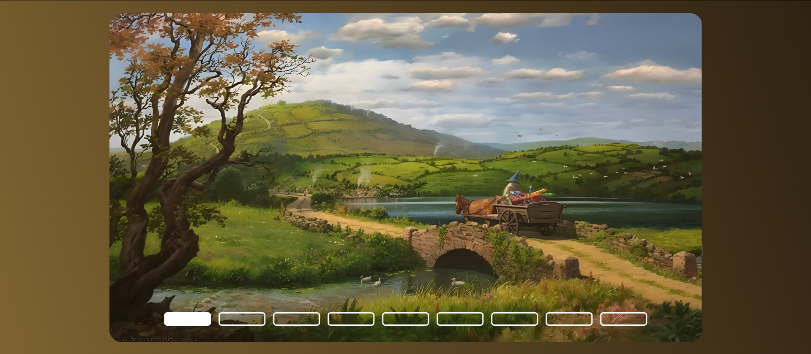

# Slideshow de paisagens da Terra-Média
## Projeto simples em HTML e CSS de um slideshow com algumas paisagem da Terra-Média, universo criado por J.R.R Tolkien.
***
Atualmente estou obcecada pela saga O Senhor dos  Anéis, então pensei em criar algo simples, mas o suficiente para me prender ao VSCode.

